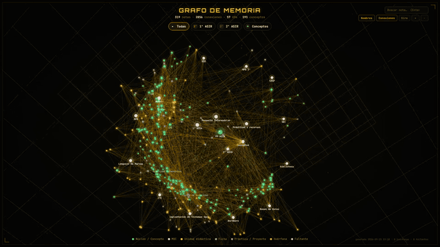

# ASIR Knowledge Graph 3D

Grafo de conocimiento 3D interactivo de mis estudios de FP ASIR (Administración de Sistemas Informáticos en Red), construido sobre un vault de Obsidian con un pipeline propio en Node.js y un renderizador en Canvas sin dependencias.

**[▶ Demo en vivo](https://ndoreste.github.io/asir-knowledge-graph-3d/)** · **[🎬 Vídeo de demostración (MP4)](assets/video/asir-knowledge-graph-3d-demo.mp4)**

[](https://ndoreste.github.io/asir-knowledge-graph-3d/)

> Trabajo en curso: el vault crece cada semana mientras curso 2º de ASIR, y este repositorio se actualiza con un único script.

## Objetivo

Convertir dos años de material del ciclo en una **red de conocimiento conectada** en lugar de una carpeta de PDFs:

- Cada unidad didáctica (UD) tiene una nota de resumen.
- Las unidades se enlazan mediante **notas de concepto** (RAID, DNS, normalización, LDAP…) que aparecen en varias asignaturas y en ambos cursos.
- Un script generador mantiene actualizados automáticamente los backlinks, los índices y los datos del grafo.
- El resultado se puede explorar como un grafo 3D en el navegador: rotar, hacer zoom, filtrar por curso y hacer clic en cualquier nodo para leer su resumen.

## Estado actual (2026-09-23)

| Notas | Enlaces | Unidades didácticas | Conceptos | Huérfanas | Enlaces faltantes |
|---:|---:|---:|---:|---:|---:|
| 319 | 2856 | 57 | 191 | 0 | 0 |

## Qué demuestra este proyecto

- **Diseño de gestión del conocimiento**: taxonomía de carpetas, tipos de nota, plantillas y MOCs (Maps of Content) para un plan de estudios de dos años.
- **Automatización con Node.js**: un script sin dependencias que analiza el frontmatter de Markdown y los `[[wikilinks]]`, resuelve alias/anclas/embeds y escribe secciones autogeneradas de vuelta en las notas.
- **Controles de calidad de datos**: en cada ejecución se informa de notas huérfanas, enlaces rotos, notas inexistentes y adjuntos rotos.
- **Renderizado 3D propio**: proyección en perspectiva, órbita de cámara, zoom, selección y filtrado escritos a mano sobre la API Canvas 2D, sin Three.js ni D3.
- **Privacidad desde el diseño**: el build público elimina correos electrónicos, enlaces a plataformas privadas, nombres de docentes y horarios, y **falla** si se filtra algo.
- **Material audiovisual reproducible**: el vídeo de demostración se renderiza fotograma a fotograma con Playwright + ffmpeg, de modo que es fluido y puede regenerarse tras cada actualización.

## Cómo funciona

```text
Obsidian vault (Markdown)
        │
        ▼
vault-tools/generar-grafo.mjs ──► updates "Aparece en" backlinks + concept index inside the notes
        │                        └► grafo-data.js  { stats, nodes[], links[] }
        ▼
scripts/build-public.mjs ───────► sanitizes node previews ──► index.html (self-contained, GitHub Pages)
        │
        ▼
scripts/record-video.cjs ───────► Playwright renders 600 frames ──► ffmpeg ──► demo MP4
```

Más detalle en [docs/architecture.md](docs/architecture.md).

## Estructura del repositorio

```text
asir-knowledge-graph-3d/
├── README.md
├── index.html                  # Public 3D graph (sanitized, data inlined) — served by GitHub Pages
├── assets/
│   ├── img/
│   │   ├── graph-overview.png
│   │   └── graph-preview.gif
│   └── video/
│       └── asir-knowledge-graph-3d-demo.mp4
├── vault-tools/                # Files that live inside the vault (Sistema/Grafo)
│   ├── generar-grafo.mjs       # Parser + backlink writer + graph data generator
│   ├── grafo-asir.html         # 3D viewer template (Canvas 2D, no dependencies)
│   └── templates/              # Obsidian templates: UD, concept, subject sheet, MOC, class notes
├── scripts/
│   ├── build-public.mjs        # Sanitized public build → index.html
│   ├── record-video.cjs        # Frame-by-frame video recorder (Playwright + ffmpeg)
│   └── update-from-vault.ps1   # One-command refresh from the vault
├── docs/
│   ├── architecture.md
│   ├── vault-structure.md
│   ├── privacy.md
│   └── updating.md
├── package.json
├── LICENSE
└── .gitignore
```

## Leyenda del grafo

| Color | Tipo de nodo |
|---|---|
| 🟢 Verde | Hub / concepto |
| ⚪ Crema | MOC (mapa de contenido) |
| 🟡 Dorado | Unidad didáctica (UD) |
| 🔵 Azul | Ficha de asignatura |
| 🟣 Violeta | Práctica / proyecto |
| 🟠 Naranja | Nota huérfana |
| 🩷 Rosa | Nota inexistente (enlazada pero aún sin escribir) |

## Ejecución en local

```bash
git clone https://github.com/ndoreste/asir-knowledge-graph-3d.git
cd asir-knowledge-graph-3d
python -m http.server 8765
# open http://localhost:8765
```

`index.html` es totalmente autocontenido, así que también funciona abriéndolo con doble clic.

## Actualización a medida que avanza el curso

```powershell
.\scripts\update-from-vault.ps1              # regenerate graph + sanitized index.html
.\scripts\update-from-vault.ps1 -Video -Push # also re-record the video, commit and push
```

Consulta [docs/updating.md](docs/updating.md).

## Stack tecnológico

- **Obsidian** (vault de Markdown, frontmatter, wikilinks, plantillas)
- **Node.js** (módulos ES, sin dependencias en tiempo de ejecución)
- **HTML / CSS / JavaScript** con la API Canvas 2D
- **Playwright** (Chromium headless) + **ffmpeg** para el vídeo
- **PowerShell** para el flujo de actualización
- **GitHub Pages** para el alojamiento

## Política de seguridad y privacidad

Este repositorio nunca incluye:

- Las notas originales del vault, PDFs ni material del curso.
- Direcciones de correo electrónico ni enlaces privados de LMS / Kahoot / NotebookLM / Google Drive.
- Nombres de docentes ni horarios de clase.
- Rutas locales, credenciales ni la configuración de `.obsidian/`.

Detalles en [docs/privacy.md](docs/privacy.md).

## Estado

Activo: 1º completado, 2º en curso (2026-2027).

## Licencia

MIT. Consulta [LICENSE](LICENSE).
